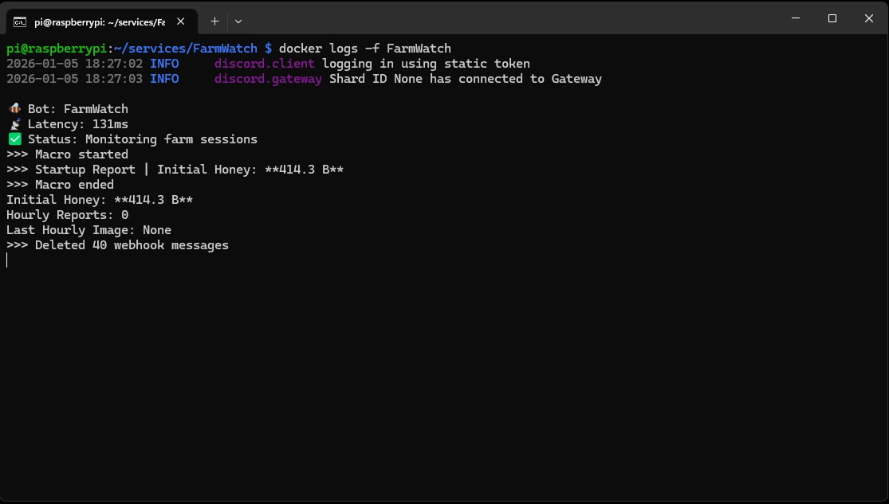

## 📖 Overview

This project is a Discord bot built to monitor the [NatroMacro](https://github.com/NatroTeam/NatroMacro) autofarm via Discord webhooks.

The bot listens exclusively to webhook embed messages sent by NatroMacro, detects when a macro session starts and ends, tracks relevant session data, and generates a clean summary once the macro finishes.

It is designed to be:
- Lightweight
- Reliable
- Easy to debug
- Suitable for Raspberry Pi and Docker environments

## ✅ Features

- **NatroMacro Webhook Integration**: Automatically detects and parses webhook embeds from NatroMacro
- Detects macro start (`Begin: Main Loop`) and end (`End: Macro`) events
- Extracts initial session data from Startup Reports
- Tracks Hourly Reports during the session
- Saves the last Hourly Report image
- Generates a session summary automatically
- Cleans the webhook channel after the session ends
- No database, no OCR, no external dependencies

## 📸 Bot in Action



The bot monitors webhook messages in real-time and displays:
- Macro start/end detection
- Initial honey amount from Startup Reports
- Hourly Report tracking
- Automatic webhook cleanup

## 🔧 Setup

### Prerequisites
- Python 3.8+
- Discord bot token
- NatroMacro configured with Discord webhooks

### Installation

1. Clone the repository
```bash
git clone <your-repo-url>
cd FarmWatch
```

2. Install dependencies
```bash
pip install -r requirements.txt
```

3. Configure your bot token and settings in `config.py`

4. Run the bot
```bash
python main.py
```

### Docker Deployment
```bash
docker build -t farmwatch .
docker run -d --name farmwatch farmwatch
```

## 🐝 NatroMacro Configuration

To enable webhook integration in NatroMacro:

1. Open NatroMacro settings
2. Navigate to the Discord webhook section
3. Add your webhook URL
4. Enable "Startup Report" and "Hourly Report" notifications

The bot will automatically detect these webhook messages and track your farming sessions.

## 🔮 Future Ideas

- Send session summaries to a separate Discord channel
- Optional DM notifications when a session ends